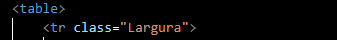
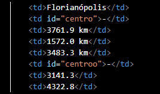
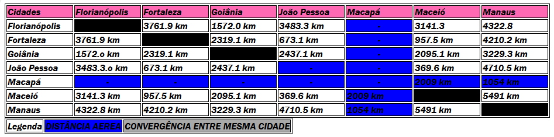

# Projeto - tabela de distâncias

projeto criado como parte avaliativa da disciplina de Fundamentos de Desenvolvimento Web ministrada pelo professor Leonardo Rocha

## Índicie

* [Descrição](#descrição)
* [Tecnologias](#tecnologias)
* [Referências](#referências)
* [Autor](#autora)

### descrição

O projeto consiste na composição de uma tabela que conta com capitais brasileiras e a distância entre essas capitais. As capitais constantes nesse projeto são:

* Florianópolis
* Fortaleza
* Goiânia
* João Pessoa
* Macapá
* Maceió
* Manaus

### Resultado do projeto

#### Tabela

Foram usados os seguintes elementos:

* Table - Cria um "Container" o qual compõe a estrutura da tabela.
* Tr - Define linha da tabela, separando as células.

Veja agora imagens dos elementos citados anteriormente:

Também foi utilizado:

* Td - Adicona os conteúdos dentro das células.

Segue a imagem ilustrativa:

####

## Tecnologias

* HTML5
* CSS3
* README
* Git
* Github

## Referências

[Alura](https://www.alura.com.br/artigos/escrever-bom-readme) - Como escrever um README incrível no seu Github

## Autora

O projeto foi desenvolvido pelo grupo:

* Ana Julia
* Isabelly
* Larissa
* Maria Luíza
* Mariane
* Vitor Souza
* Vivian